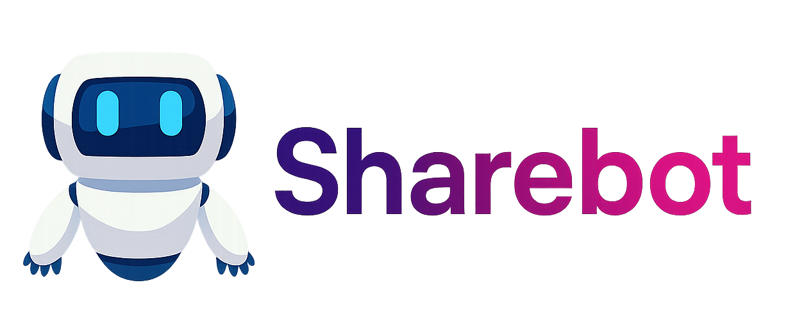

# Sharebot

<p align="center">
  <a href="LICENSE">
    
  </a>
  <a href="https://github.com/5yearsKim/sharebot/issues">
    
  </a>
</p>

<p align="center">
  
</p>

Sharebot is a platform that allows users to upload their documents and interact with a chatbot which leverages Retrieval-Augmented Generation (RAG) to answer questions based on the content. This repository comprises both backend and frontend components, as well as containerized services for database, search engine, and the RAG engine.

---

## Table of Contents

- [Project Structure](#project-structure)
- [Docker Compose Overview](#docker-compose-overview)
- [Features](#features)
- [Installation & Setup](#installation--setup)
- [Usage](#usage)
- [Architecture Overview](#architecture-overview)
- [Contributing](#contributing)
- [License](#license)
- [Contact](#contact)

---

## Project Structure

Below is the directory structure for the Sharebot project:

```sh
assets
docker-compose.yml
docker_imgs
engine
qdrant
README.md
scripts
sharebot-back
sharebot-front
```

This structure includes assets (such as your logo), docker configuration files, separate directories for the engine, backend, and frontend, as well as additional scripts and storage directories.

---

## Features

- **Document Upload:** Simple document uploads with multi-format support.
- **Intelligent Q&A:** Chatbot that answers your questions by leveraging context from your documents using RAG.
- **Containerized Services:** Efficient deployment with Docker Compose managing service dependencies.
- **Scalable Architecture:** Modular design allowing easy extension and maintenance.

---

## Installation & Setup

1. **Clone the Repository**

```bash
git clone https://github.com/5yearsKim/sharebot.git
cd sharebot
```

2. **Setup Environment Variables**

Create `.env` files as required in the respective folders (`engine`, `sharebot-back`, etc.) based on the provided `.env.docker.example` files.

3. **Run Docker Compose**

Launch the entire application ecosystem with:

```bash
docker-compose up -d
```

This command will build and start all services in detached mode.

---

## Usage

Once the services are running:

- **Upload Documents:** Navigate to the frontend interface to upload your documents.
- **Chat Interface:** Interact with the chatbot which utilizes RAG to provide context-aware answers.
- **Monitor Services:** Use `docker-compose ps` to view running containers and `docker logs <container-name>` for debugging.

---

## Architecture Overview

Sharebot is built on a robust architecture to handle document management and AI-powered interactions:

- **Frontend:** Provides a user-friendly interface for document uploads and chat-based querying.
- **Backend:** Processes uploaded documents, forwards requests to the engine, and handles business logic.
- **Engine (RAG):** Combines retrieval from indexed documents with generative responses.
- **Database & Qdrant:** Stores persistent data and serves as the search vector store for document contents.

---

## Contributing

Contributions are welcome! To contribute:

1. Fork the repository.
2. Create a new branch for your feature or bugfix.
3. Make your changes following the project coding guidelines.
4. Submit a pull request with a detailed description of your changes.

For major changes, please open an issue to discuss your proposal first.


## License

This project is licensed under the MIT License. See the [LICENSE](LICENSE) file for details.


Happy coding and enjoy using Sharebot!
